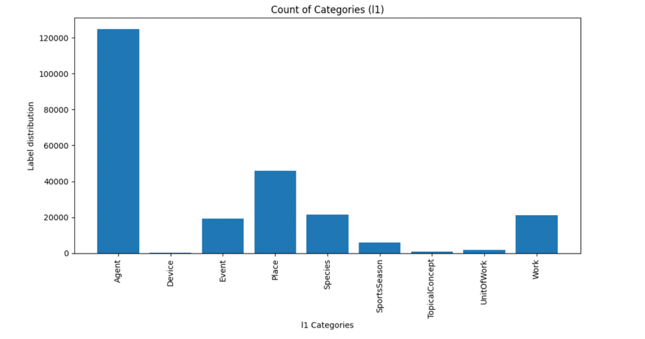
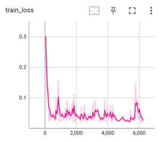
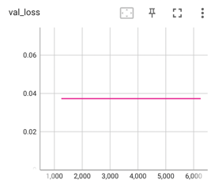
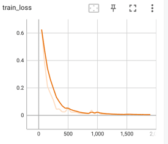
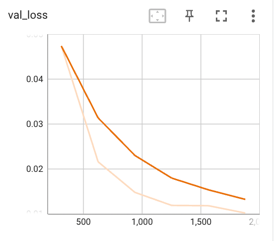
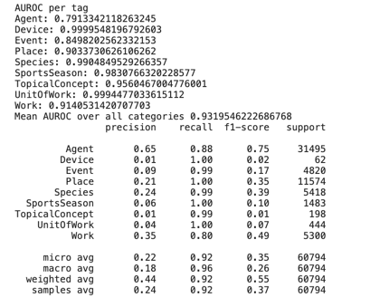
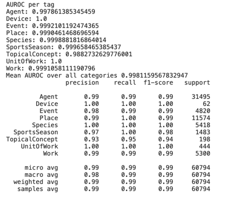
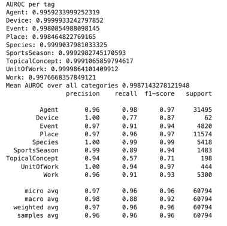

 

#  Wiki Taxonomy Classifier

**Goal:** Predict the taxonomic category of wikipedia articles from their text. This project aims to
predict the L1 classes. L1 classes are 9 category classes.

**Dataset used to train the model:** Open source dataset available on kaggle: https://www.kaggle.com/danofer/dbpedia-classes.

# Instalation

# Project development process

## 1. Data exploration 

I started the project by performing a very simple data exploration. This can be seen in
"src/notebooks/DataExploration". Two important concepts conclusions were drawn from it: First, the
dataset is highly imbalance with class "Agent" containing most of the observations. This holds
from both train, validation and test sets, as can be seen below:

Secondly, I explored BERT tokenizer usage to tokenize the text and subsequently generated a
histogram showcasing the frequency distribution of total tokens in each Wikipedia article within
the training set. It became evident that the majority of Wikipedia articles contained either less
than 300 tokens or more than 512 tokens. Consequently, I took the decision to set the maximum token
length for the tokenizer to 512 tokens.

Furthermore, throughout the project's development, I identified words that were rarely encountered
across all Wikipedia articles and others that appeared significantly more frequently. With that in
mind, I would have liked to do some extra steps in terms of preprocessing:
- Removing non-English alphabet characters: This step aimed to create room for additional tokens,
particularly when the text exceeded the defined maximum length (512 tokens), potentially adding more
informative content.
- Eliminating words with frequencies below a specified threshold: Similar to the previous point,
this step sought to enhance token utility.
- Converting Wikipedia articles to lowercase: While capitalized words often carry emotional
connotations in sentiment analysis, in this context, it didn't appear to contribute significantly.

## 2. Model decision

In terms of model selection, I opted for the DistilBert pre-trained model, augmented with a
classification head, and compared it against a baseline logistic regression model.

   1. For the modelling, I decided to explore with a state of the art language model. My choice
landed on DistilBert, primarily due to its slightly smaller size than the original Bert model,
offering a minimal performance trade-off while significantly boosting training and inference speed.
The choice of this language model was largely due to the fact that these models contain contextual
understanding of text, i.e., they can understand words in the context of the entire sentence, which
allows to better capture the meanings of the words in the text. Consequently, traditional text
preprocessing steps such as stopword removal and stemming became unnecessary.

   On top of the DistilBert model, I have trained a classification head which would receive the last
hidden state of the DistilBert model and learn to classify the input text into one of the 9 L1
    class categories.

   2. Secondly, it's essential to establish a baseline as a standard practice when developing a new
model. For this purpose, I opted for a logistic regressor employing TF-IDF features. TF-IDF (Term
Frequency-Inverse Document Frequency), was chosen due to its ability to quantify the importance of
words in an article concerning the entire corpus of Wikipedia articles in the dataset. Logistic
regression, on the other hand, was selected because of its simplicity and effectiveness as a
baseline model for classification tasks.

## 3. Model Training

Considering the imbalanced nature of the dataset, my expectation was that the model might exhibit
overfitting tendencies, particularly towards the majority class. Unfortunately, due to memory
limitations on Google Colab, I couldn't increase the batch size for training, which would have
allowed the model to encounter articles from various classes more frequently (potentially avoid
overfitting).

As a result, the two plots below clearly illustrate a classic case of overfitting: the training loss
shows a decreasing trend with occasional abrupt jumps (likely attributed to certain batches
containing articles from minority classes), while the validation loss plateaus.

With this in mind, I incorporated class weights into the Cross Entropy loss function. The objective
was to assign a higher penalty for misclassifying the minority classes, hence addressing the issue
of class imbalance. To ensure stability during training and prevent potential gradient explosions,
I calculated and normalized the class weights based on the label distribution in the dataset.
Additionally, I applied gradient clipping to further mitigate the risk of gradient-related problems.
This approach resulted in a steady reduction in both training and validation loss. Finally, to add
an extra layer of regularization, weight decay was also implemented.

Alternative strategies could have involved implementing a dropout layer or introducing an additional
linear layer between the BERT hidden state layer and the output layer. These modifications could
enhance the flow of information from BERT hidden state to the final output. Additionally,
additional fine-tuning hyperparameters like the learning rate, learning rate scheduler, and others
could have further refined the model's performance

## 4. Model Evaluation

For the model evaluation, I focused on two key metrics: AUROC (Area Under the Receiver Operating
Characteristic Curve) and F1 score.

   - **AUROC**: It helps to evaluate the model ability to distinguish between positive and
negative samples of a given class. To evaluate it, I treated the problem as a binary classification
for each class, calculated the AUROC for each, and then averaged these values across all classes.
   - **F1 score**: It helps to focus on how well the model is performing for each class
individually.

As evident in the plot below, during the first iteration of the BERT-based model, several
misclassifications occurred, particularly for classes with limited examples. Furthermore, it's
noticeable that the model exhibits lower precision but higher recall for the majority classes like
"Agent" and "Place," which is a clear indication of potential overfitting.

The results obtained after implementing the techniques described above are represented in the image
below. The improvement in performance is quite remarkable. The model demonstrates a clear capability
to accurately classify L1 taxonomies from textual articles. Such performance is largely attributed
to the utilization of DistilBert embeddings/model in conjunction with the regularization
and class weight strategies detailed earlier.

Lastly, it is important to compare the performance of the model versus a simple but strong baseline.
The results for the logistic classifier with TF-IDF features are displayed below.
As evident from the results, this uncomplicated baseline already excels in the taxonomy
classification task.
Given the complexity of the large language models, the large training and inference
times, this simple baseline might have sufficed and possibly emerged as the optimal choice for
deploying a production-ready solution to tackle this problem. However, I maintain some reservations
regarding whether the same results would apply to a more challenging classification task, such as
predicting the L2 taxonomy classes, which encompass 70 classes.

## 5. Model Interpretability

For the model interpretability, I decided to use shap values as a proxy to know which features are
the most important for a given taxonomy class. Please note that the shap values were
only computed for a small sample set due to the large computation time required.

The outcomes of this feature importance analysis can be explored in the Streamlit application.
What's interesting to note is that when one examines the BERT-based model, some of its most
'significant' features turned out to be rather mundane/less informative, like 'K,' 'tel,' and 'e.'

However, there was a noteworthy twist when one considers the 'Agent' category. Here, the
model's top features suddenly aligned more logically with taxonomy classification,
indicating a more insightful model interpretation.

## 6. Future steps

As a consideration for future steps in the L2 taxonomy prediction task, I would have liked to
compare the performance of the BERT-based model after applying all the preprocess steps
mentioned in the [Data Exploration](#data-exploration-anchor).  I believe the difference in
performance for this harder classification task would have been considerably higher.

Another interesting idea for future exploration involves utilizing the BERT-based model to predict
the class L1 taxonomy label and subsequently incorporating this classification label into the text
of each article. This approach is inspired by the hierarchical nature of the taxonomy labels,
from L1 to L2. The idea is that the model could benefit from having knowledge of the L1 category
taxonomy to which an article has been labelled.
